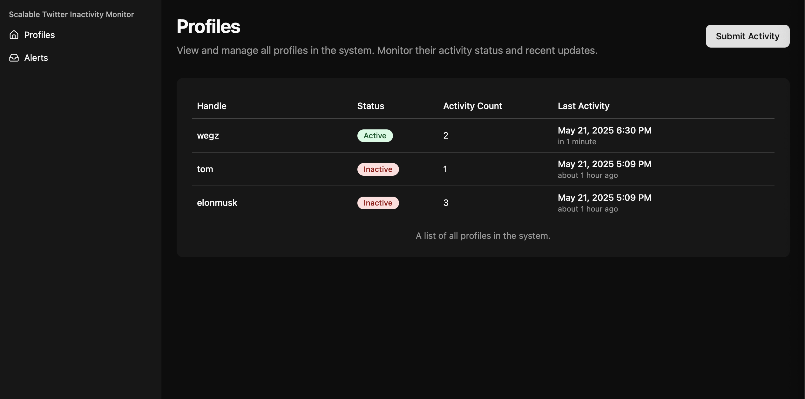

# 🐦 Twitter Activity Monitoring System

A scalable microservices-based system for monitoring Twitter profile activities and inactivity alerts using a producer-consumer architecture.

## 🏗️ System Architecture



## ✨ Key Features

- 🔄 Real-time activity monitoring
- 📊 Scalable microservices architecture
- 🔌 Asynchronous message processing
- 🚀 High availability with service replication
- 📈 Horizontal scaling support
- 🔒 Secure API endpoints
- 📝 Activity logging and tracking
- ⚡ Inactivity alerts

## 🚀 Quick Start

### Prerequisites

- Docker and Docker Compose
- Git

### Running the System

1. Clone the repository:
   ```bash
   git clone <repository-url>
   cd scalable-twitter-activity-monitor
   ```

2. Start the services:
   ```bash
   docker-compose up -d
   ```

## 🔌 Service Access

### API Service
- **URL**: `http://localhost:80`

### RabbitMQ Management
- **URL**: `http://localhost:15672`
- **Default Credentials**:
  - Username: `guest`
  - Password: `guest`

### PostgreSQL
- **Port**: `5432`
- **Default Credentials**:
  - Username: `postgres`
  - Password: `postgres`
  - Database: `twitter_activity`

## 📦 Service Ports

| Service    | Port  | Description                    |
|------------|-------|--------------------------------|
| API        | 80  | REST API endpoints               |
| RabbitMQ   | 5672  | AMQP protocol                 |
| RabbitMQ   | 15672 | Management interface          |
| PostgreSQL | 5432  | Database access               |

## 🔄 Scaling Configuration

The system is designed for horizontal scaling, particularly the consumer service. In the `docker-compose.yml`, the consumer service is configured with:

```yaml
consumer:
  deploy:
    replicas: 3  # Number of consumer instances
    resources:
      limits:
        cpus: '0.5'
        memory: 512M
    restart_policy:
      condition: on-failure
```

This configuration allows the consumer service to:
- Run multiple instances for load balancing
- Automatically restart on failures
- Distribute message processing across instances
- Handle increased message volume

## 🔍 Monitoring

- **API Metrics**: `http://localhost:3000/metrics`
- **RabbitMQ Metrics**: `http://localhost:15672/api/metrics`
- **Queue Status**: `http://localhost:15672/#/queues`

## 🛠️ Development

### Local Development
```bash
# Start services in development mode
docker-compose -f docker-compose.dev.yml up -d

# View logs
docker-compose logs -f

# Stop services
docker-compose down
```

### Production Deployment
```bash
# Start services in production mode
docker-compose -f docker-compose.prod.yml up -d

# Scale consumer service
docker-compose -f docker-compose.prod.yml up -d --scale consumer=5
```

## 📚 Documentation

- [API Documentation](backend/api/README.md)
- [Producer Service](backend/producer/README.md)
- [Consumer Service](backend/consumer/README.md)
- [RabbitMQ Service](backend/rabbitmq/README.md)

## 🔒 Security Notes

- Change default credentials in production
- Use environment variables for sensitive data
- Enable SSL/TLS for production deployments
- Configure proper firewall rules
- Implement rate limiting

## 🤝 Contributing

1. Fork the repository
2. Create your feature branch
3. Commit your changes
4. Push to the branch
5. Create a Pull Request

## 📄 License

ISC 